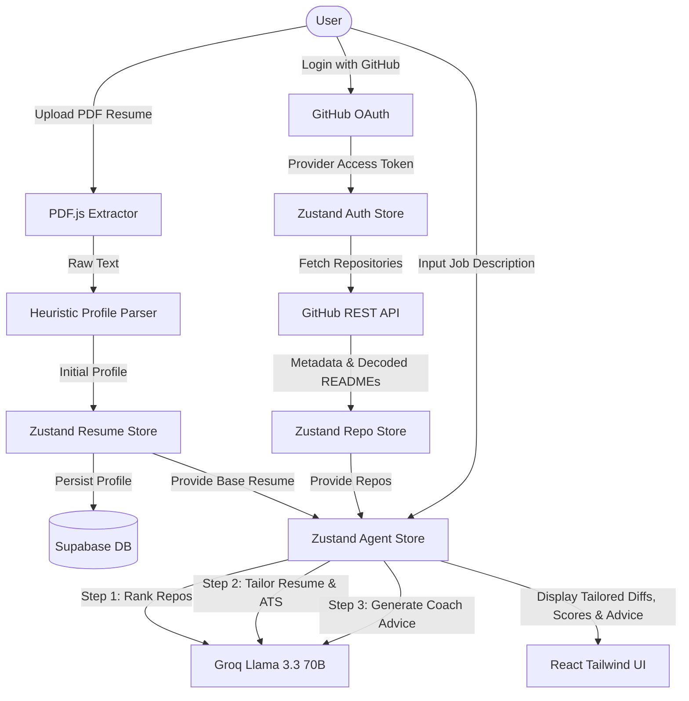

# 🎯 JobLens — Agentic Resume Tailoring Assistant

JobLens is a modern, premium AI-powered web application designed to help job seekers tailors their resumes dynamically to match specific target job descriptions. By integrating with a user's GitHub repositories and analyzing their professional resume, JobLens uses a multi-step agentic AI pipeline to rank relevant projects, rewrite resume experience bullet points with target keywords, and deliver strategic career coaching insights.

Built with a dark-mode glassmorphic interface inspired by the Linear design system, JobLens runs client-side resume parsing and coordinates parallel API calls to Supabase, GitHub, and Groq LLMs.

---

## ⚡ Key Features

1. **Aesthetic Dark-Mode UI**: Implements a sleek dark-mode design system with subtle glow backdrops, crisp borders, and smooth transitions using Tailwind CSS.
2. **GitHub OAuth & Supabase Auth**: Secure, passwordless login using GitHub OAuth, persisted automatically via Supabase Auth and client session triggers.
3. **Automated GitHub Syncer**: Pulls repository listings, primary languages, topics, and automatically decodes repository `README.md` files in parallel.
4. **Client-Side PDF Text Extraction**: Uses `pdfjs-dist` to parse text contents from resumes directly in the browser, bypassing the need for heavy backend upload servers.
5. **Interactive Profile Editor**: Lets users review and manually adjust parsed resume data (contact info, skills, education, experience, projects) before saving.
6. **Multi-Stage AI Recruiter Agent (Groq / Llama 3.3 70B)**:
   - **Stage 1: Project Ranker** – Evaluates all repositories and matches the top 3 projects to the job description.
   - **Stage 2: Resume Rewriter & ATS Scorer** – Optimizes resume experience bullets to target relevant keywords and computes ATS scores before/after.
   - **Stage 3: Career Coach** – Provides candidate strengths, gaps, actionable advice, and typical interview prep questions.
7. **Zustand State Stores**: Separated, reactive global stores for Authentication, Repository Syncing, Resume Management, and AI Agent states.

---

## 🏗️ Architecture & Data Flow



---

## 🛠️ Technical Stack

- **Frontend Core**: React 19, TypeScript, Vite 8
- **Styling**: Tailwind CSS v4 (native `@tailwindcss/vite` configuration)
- **Routing**: React Router DOM v7
- **State Management**: Zustand v5
- **Database / Backend-as-a-Service**: Supabase Client v2
- **LLM Integration**: Groq REST API (Llama-3.3-70b-versatile model)
- **PDF Extraction**: PDF.js (`pdfjs-dist` v6)
- **HTTP Clients**: Axios v1

---

## 📦 Project Directory Structure

```text
JobLens/
├── public/                 # Static assets (Favicons, Vector Icons)
├── src/
│   ├── assets/             # Images and branding components
│   ├── components/         # Reusable layouts (Navbar, ProtectedRoute)
│   ├── lib/                # Configured SDK instances and parsing libraries
│   │   ├── supabase.ts     # Supabase JS configuration
│   │   └── parseResume.ts  # PDF text structuring heuristics
│   ├── pages/              # Routing pages (Login, Onboarding, Dashboard, Analyze)
│   ├── store/              # Zustand state stores (auth, resume, repo, agent)
│   ├── types/              # TypeScript types and interface definitions
│   ├── App.tsx             # Main routing hub
│   ├── index.css           # Global theme variables & custom utilities
│   └── main.tsx            # DOM root mounting
├── schema.sql              # Supabase database setup schema
├── tsconfig.json           # TS base settings
└── vite.config.ts          # Vite configuration
```

---

## ⚙️ Getting Started

### 1. Prerequisites
- **Node.js** (v18.0.0 or higher)
- **npm** (v9.0.0 or higher)

### 2. Installation
Clone the repository and install dependencies:
```bash
git clone https://github.com/varun047/JobLens.git
cd JobLens
npm install
```

### 3. Environment Secrets Setup
Create a `.env` file at the root of the project:
```env
# Supabase Authentication & Database Configuration
VITE_SUPABASE_URL=https://your-project-id.supabase.co
VITE_SUPABASE_ANON_KEY=your-anon-public-key

# AI Orchestration (Groq API Console Key)
VITE_GROQ_API_KEY=gsk_your_groq_api_key_goes_here
```

### 4. Supabase Setup
Initialize the database structure by running the contents of `schema.sql` in the **Supabase SQL Editor**:
1. Creates the `public.users` user metadata profile database.
2. Creates the `public.resumes` JSONB storage container database.
3. Sets up **Row Level Security (RLS)** policies ensuring users can only read/edit their own documents.
4. Binds an automated trigger `public.handle_new_user()` that registers incoming GitHub OAuth signups instantly.

### 5. GitHub OAuth Configuration
1. Register a new OAuth application in GitHub: **Settings** -> **Developer Settings** -> **OAuth Apps** -> **New OAuth App**.
2. Set Homepage URL to `http://localhost:5173`.
3. Set callback URL to your Supabase callback: `https://your-project-id.supabase.co/auth/v1/callback`.
4. Copy the Client ID and Secret and insert them into the **Supabase Auth -> Providers -> GitHub** dashboard.

---

## 🚀 Running the Application

### Development Server
```bash
npm run dev
```
Open [http://localhost:5173](http://localhost:5173) in your browser.

### Production Build
Compile and bundle the production code:
```bash
npm run build
```

### Local Production Preview
Verify the production build locally:
```bash
npm run preview
```
